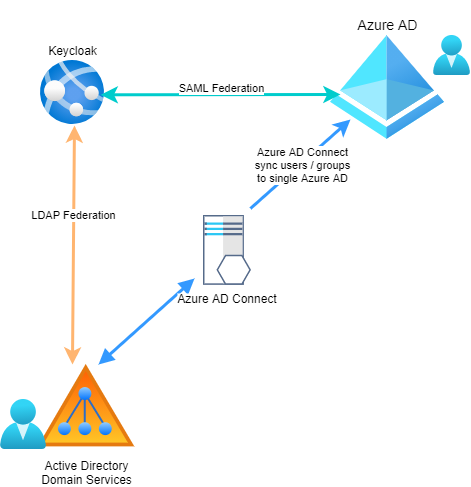

> **Disclaimer:** This information is provided `as is` with best effort to cover details as of August 2021. This is, in no way, an official document or statement of any vendor. The author / authors disclaim liability for any damages that arise from acting upon the information provided in this document. 

# Use KeyCloak as SAML 2.0 Identity Provider for Single Sign-On with Azure AD

This document contains information on how to configure Azure AD in Azure Commercial Cloud (not Government, China or any other sovereign cloud) to use KeyCloak as SAML 2.0 compliant SP-Lite profile based as the preferred Security Token Service (STS) / identity provider. This scenario is usefull when KeyCloak is fully integrated in your environment and you are bound by compliance requirements to not use other federation services / security token services. The SAML 2.0 SP-Lite profile is based on the widely used Security Assertion Markup Language (SAML) federated identity standard to provide a sign-on and attribute exchange framework.

> **NOTE:** Microsoft is no longer testing 3rd party Identity Providers for compatibility. For a list of 3rd party IdPs that have been tested for use with Azure AD see the [Azure AD federation compatibility list](https://bit.ly/as-kc-008).

For more information and supported SAML2 modalities/requirements, pelase refer to the official documentation [Use a SAML 2.0 Identity Provider (IdP) for Single Sign On](https://bit.ly/as-kc-fed-007)

After you finish with steps in this documentaion, you will have a working setup represented by the following diagram:



## Prepare your environment
Of course signing-in users is an important step. However, before we can sign-in any user over KeyCloak, our Azure AD tenant must be _informed_ that there will be a user, whose authentication authority is somewhere else. In other words, a user identity _must_ exist within Azure AD. Today, the only supported way to get on-premises identities into Azure AD is to use [Azure AD Connect](https://bit.ly/as-kc-fed-001). Please familiarize yourself with [Azure AD Connect](https://bit.ly/as-kc-fed-001) before you proceed. 

> **Note:** In order to install Azure AD Connect and synchronize user identities, you must own a publicly routable domain name and verify it with your Azure AD. This domain will later be used as upn suffix (or e-mail domain) for your users to sign-in. You can read more about the procedure and requirements in the official documentation: [Add and verify custom domain](https://bit.ly/as-kc-fed-004).

> **Note:** The most important aspect of Identity synchronization is the choise of the so called `source anchor`. This is the attribute that uniquely identifies a user object in your on-premises environment. This attribute is sealed on the special user property `onPremisesImmutableId` of the cloud user object. This property (`onPremisesImmutableId`) is a `write-once-read-many` type of property. This means, that you can set the value of that property when the user object is created, but you cannot change this value later on. Please take your time to read through the [Azure AD Connect: Design Concepts](https://bit.ly/as-kc-fed-002) document for better understanding.

As you can read from the documentation, Azure AD Connect by default takes the user's `objectGUID` attribute from on-premises enviornment and synchronizes that to the `onPremisesImmutableId` attribute.

### Install and configure Azure AD Connect
The first step is to install and configure Azure AD Connect. You can read more about [Installing and configuring Azure AD Connect and Azure AD Connect health](https://bit.ly/as-kc-fed-003) following the official guidance.
For this proof-of-concept setup, I used a customized installation of Azure AD Connect by choosing the following options:

 1. Choose `Customize` ([image](./media/aadc-001.jpg)).
 2. Do not check any of the checkboxes and click on `Install` ([image](./media/aadc-002.jpg)).
 3. For `User sign-in` chose `Do not configure` ([image](./media/aadc-003.jpg)). Alternatively you can choose `Password hash sync`. The latter is usefull in case of issues with your federation infrastructure. You can easily switch from federated authentication to password hash sync (sign-in in cloud) type of authentication for your users. This helps to avoid loosing complete access to your cloud services in case of issues with federation infrastructure.
 4. Enter your `Global Administrator` credentials for Azure AD to proceed to next step ([image](./media/aadc-004.jpg))
 5. To connect your on-premises Directory (Forest) you need to enter credentials. The screen contains a description of the account type you can use (Domain Administrator vs. Enterprise Administrator). For my setup, I used `Enterprise Administrator` account ([image](./media/aadc-005.jpg))).
 6. Once you successfully authenticated for the choosen forest, you can proceed to next step ([image](./media/aadc-006.jpg)).
 7. Configure the `Azure AD sign-in`. There is important information in regards to this step ([image](./media/aadc-007.jpg)):
  * All verified domain names will be listed here. The list does not neccessarily match your configured UPN suffixes. If this is the case, you may want to check the `Continue without matching all UPN suffixes to verified domain` checkbox. 
  * `USER PRINCIPAL NAME` configuration. Here you must select which on-premises attribute will be used as a cloud sign-in name. Recommended configuration is to use the on-premises `userPrincipalName`. For this proof of concept I chose `userPrincipalName` You can read more about this important configuration on the [official documentation](https://bit.ly/as-kc-fed-005).
 8. Domain / OU Filtering. I chose to synchronize only single OU ([image](./media/aadc-008.jpg)).
 9. Leave all settings are are (`All users are represented only once` and `Let Azure manage source anchor`) ([image](./media/aadc-009.jpg)).
 10. Filtering. I chose to synchronize all users and devices. Remember that I only chose single OU on step `8`. This option here will synchronize all Users, Security Groups and devices from that OU into Azure AD ([image](./media/aadc-010.jpg)).
 11. For my demos, I like to add some extra attributes to be synchronized. So I chose the `Directory extension attribute sync`. Optionally, if you want to limit the attributes being synced to Azure AD, you can also choose `Azure AD app and attribute filtering` ([image](./media/aadc-011.jpg)).
 12. Here I just leave all relevant apps as they are. No changes on this screen ([image](./media/aadc-012.jpg)).
 13. Here I just leave all relevant Azure attributes. No changes on this screen ([image](./media/aadc-013.jpg)).
 14. On the `Directory extensions` I chose `employeedId` and `employeeNumber` attributes to be also synchronized ([image](./media/aadc-014.jpg)).
 15. Finally I chose `Start synchronization process when configuration completes` and click on `Install` ([image](./media/aadc-015.jpg)).

Once Azure AD Connect is installed, wait a couple of minutes and verify that all users and groups from the chosen OU (`step (8)`) are synchronized.

Now, that we have verified domain in Azure AD and running Azure AD Connect sync engine, we can proceed with Key Cloak and Azure AD configuration for federated authentication.
 
## Configure KeyCloak for user federation with the same on-premises Active Directory

In order for our setup to work, we need to insturct KeyCloak to authenticate the users within the Active Directory (LDAP) that we are synchronizing. If you have already done so, you can skip to next step.

1. Navigate to your KeyCloak instance, sign-in with the adminsitrator account and chose the realm where you want to configure everything.
2. Navigate to `User federation` and from the `Add provider` chose `ldap` ([image](./media/kc-001.jpg)).
3. Choose:
 * `Active Directory` from the `Vendor` drop down list.
 * `READ_ONLY` for `Import mode`
 * `ON` for `Import users`
 * `OFF` for `Sync registratins` (you do not really want to write to your LDAP directory user that registered themself in your KeyCloak)
4. From the auto populated fields, I only changed the `username LDAP attribute` to `sAMAccountName` ([image](./media/kc-003.jpg))
5. Enter neccessary details to connect to your LDAP directory. If you configured `OU Filtering` in Azure AD Connect, like we did here, make sure to also filter to that same OU ([image](./media/kc-002.jpg)).
6. Enter LDAP connection details - server address, bind type and user credentials.

Once you have completed these settings and successfully tested both connection and authentication data, you can save the settings and navigate to `Mappers`. Leave all default attributes as they are, but add a new one ([image](./media/kc-004.jpg)) with the following values:
 * `Type` set to `user-attribute-ldap-mapper`
 * `User Model Attribute` set to `ImmutableID`
 * `LDAP Attribute` set to `ObjectGUID`
 * `Read Only` set to `ON`
 * `Always Read Value from LDAP` set to `ON`
 * `Is Mandatory in LDAP` set to `OFF`
 * `Attribute default value` leave blank
 * `Is Binary Attribute` set to `ON`

Save the configuration and test it - try to sign-in to the configured realm with a user from your LDAP directory.

> **NOTE:** We need this mapper in order to provide the correct `ImmutableID` later to Azure AD. If you remember, Azure AD Connect was configured to write the user's `objectGUID` into the `onPremisesImmutableId` (source anchor) attribute. This is the attribute that does the match between the synchronized user and the signed-in user.

## Configure Azure AD as SAML 2.0 Service Provider (client) in KeyCloak

### Collect data from your Azure AD that you will need to configure KeyCloak
Before you can register Azure AD as service provider (`client`) in KeyCloak, you would to get some informaiton (like `entityID`, `Assertion Consumer Service URL` and others).

Navigate to Azure AD Service Provider Metadata at <https://nexus.microsoftonline-p.com/federationmetadata/saml20/federationmetadata.xml> and take a note of the:

* `entityID` attribute's value of the `EntityDesriptor` element. For example:
  ```xml
  <EntityDescriptor 
    xmlns="urn:oasis:names:tc:SAML:2.0:metadata"
    xmlns:alg="urn:oasis:names:tc:SAML:metadata:algsupport"
    ID="_7be4c01c-d488-4c18-97be-546c5aae42be"
    entityID="urn:federation:MicrosoftOnline">
  ```

* `Location` attribute of the `AssertionConsumerService` element within `SPSSODescriptor`. It usually is `https://login.microsoftonline.com/login.srf`, but make sure you take it from the actual metadata document. E.g.:
```xml
<SPSSODescriptor WantAssertionsSigned="true" protocolSupportEnumeration="urn:oasis:names:tc:SAML:2.0:protocol">
  <KeyDescriptor use="signing">
    ...
  </KeyDescriptor>
  <KeyDescriptor use="signing">
    ...
  </KeyDescriptor>
  <SingleLogoutService Binding="urn:oasis:names:tc:SAML:2.0:bindings:HTTP-POST" Location="https://login.microsoftonline.com/login.srf"/>
  <NameIDFormat>urn:oasis:names:tc:SAML:1.1:nameid-format:emailAddress</NameIDFormat>
  ...
  <AssertionConsumerService Binding="urn:oasis:names:tc:SAML:2.0:bindings:HTTP-POST" Location="https://login.microsoftonline.com/login.srf" index="0" isDefault="true"/>
  <AssertionConsumerService Binding="urn:oasis:names:tc:SAML:2.0:bindings:HTTP-POST-SimpleSign" Location="https://login.microsoftonline.com/login.srf" index="1"/>
  <AssertionConsumerService Binding="urn:oasis:names:tc:SAML:2.0:bindings:PAOS" Location="https://login.microsoftonline.com/login.srf" index="2"/>
</SPSSODescriptor>
``` 

### Create a new client in KeyCloak's realm 
Now let's create a new client within KeyCloak's realm where we configured LDAP user federation ([image](./media/kc-005.jpg)):

 1. Click on `Clients` and then click on `Create` button
 2. For `Client ID` enter the value of `entityID` for Azure AD you noted in previous steps. It used to be `urn:federation:MicrosoftOnline`, but you shall consult the Azure AD SP metadata document for the current value
 3. Choose `saml` from the `Client Protocol` drop down
 4. Leave `Root URL` blank
 5. Click `Save`

### Complete client configuration
Once you enter basic required information for the new client it is time to fully configure it. Navigate to your newly create client and click on it's `client id` to navigate to the `Settings` page of the client's configuration. Proceed as following:

 1. `Client ID` is already populated (`urn:federation:MicrosoftOnline`), but make sure it matches the `entityID` in Azure AD's SP federation metadata
 2. `Name` type `Azure AD`
 3. `Description` type `Azure AD Federation`
 4. `Enabled` set to `ON`
 5. `Always Display in Console` set to `OFF`
 6. `Consent Required` set to `OFF`
 7. `Login Theme` leave blank
 8. `Client Protocol` should be preselected, but make sure it is `saml`
 9. `Include AuthnStatement` set to `ON`. This one is especially important when you later want to configure MFA (Multi Factor Authentication)
 10. `Include OneTimeUse Condition` set to `OFF`
 11. `Force Artifact Binding` set to `OFF`
 12. `Sign Documents` set to `ON`
 13. `Optimize REDIRECT signing key lookup` set to `OFF`
 14. `Sign Assertions` set to `ON`
 15. `Signature Algorythm` set to `RSA_SHA256`
 16. `SMAL Signature Key Name` set to `KEY_ID`
 17. `Canonicalization Method` set to `EXCLUSIVE`
 18. Set to `OFF` all of the following options: 
  * `Encrypt Assertions`
  * `Client Signature Required` (Azure AD does not sign the `AuthNRequest` statements)
  * `Force POST Binding` (this one you may actually turn `ON` if you prefer), 
  * `Front Channel Logout` (you can also turn this `ON` if you prefer. If you turn this on, make sure you indicate the correct URL - you take this from the `Location` attribute of the `SingleLogoutService` element of the Azure AD SP metadata)
  * `Force Name ID Format` - just let the NameID format to match the `AuthNRequest`.
  19. `Name ID Format` set to `persistent`
  20. `Root URL` leave blank
  21. `Valid Redirect URIs` either leave blank or set to the `AssertionConsumerService` URL you noted from the Azure AD SP's metadata
  22. `Base URL` leave blank
  23. `Master SAML Processing URL` set to the `AssertionConsumerService` URL you noted from the Azure AD SP's metadata
  24. `IDP Initiated SSO URL Name` leave blank (or set to value of your choice)
  25. `UDP Initiated SSO Relay State` leave blank
  16. Leave default values for all other settings.
  17. Click `Save`.

  ### Configure `Client Scopes` for the client
  It is important to remove all client scopes that are predifined for this client. Azure AD does not understands and ignores what KeyCalok could potentially sent in scopes.

  ### Configure `Mappers` for Azure AD Federation
  The last and most important step, is to properly configure `Mappers` so that KeyCloak issues correct assertions in the SAML response. According to the documentation, there are only two important identifiers that must be sent: `ImmutableID` and `UPN`. These two must exactly match the values of a synchronized user identity. So let's start with the mappers:

  1. Click on `Create` and then choose `User Attribute Mapper for NameID`. Enter the following values ([image](./media/kc-009.jpg)):
   * For `Name` enter `ImmutableID-NameID`
   * For `Name ID Format` choose `urn:oasis:names:tc:SAML:2.0:nameid-format:persistent`
   * For `User Attribute` enter `ImmutableID`
  2. Add new mapper of type `User Attribute` and enter the following values ([image](./media/kc-010.jpg)):
   * For `User Attribute` enter `ImmutableID`
   * `Friendly Name` leave blank
   * For `SAML Attribute Name` enter `http://schemas.microsoft.com/LiveID/Federation/2008/05/ImmutableID`
   * For `SAML Attribute NameFormat` choose `URI Reference`
   * `Aggregate attribute values` set to `OFF` (this is a signle valued attribute)
  3. Add new mapper of type `User Property` and enter the following values ([image](./media/kc-011.jpg)):
   * For `Property` enter `Email`
   * `Friendly Name` leave blank
   * For `SAML Attribute Name` enter `http://schemas.xmlsoap.org/claims/UPN`
   * For `SAML Attribute NameFormat` choose `URI Reference`
   > **NOTE:** In this sample I am sending the User's Email property as `UPN` to match a synchronized user. It is important here that you choose the correct proeprty (or attribute) that would match the `UPN` for the synchronized user. This depends on how you configured `Azure AD Connect` in step (7) - `USER PRINCIPAL NAME CONFIGURATION`

   These are the three mappers that are important and ncessesary to configure federation with Azure AD.

## Configure Azure AD for federated sign-in with KeyCloak

   For this step you will need the [MSOnline PowerShell Module](https://bit.ly/as-kc-fed-006) and the KeyCloak's SAML federation metadata.

   1. Navigate to KeyCloak's SAML 2.0 federation metadata for the configured realm, e.g. `Realm settings` -> `Endpoints` -> `SAML 2.0 Identity Provider Metadata` ([image](./media/kc-012.jpg)) and take a note of:
    * `entityID` attribute of the root (`entityDesriptor`) element
    * `Location` attribute of the `SingleSignOnService` element that has `HTTP-POST` binding
    * The value of the `<ds:X509Certificate>` element
   2. Start a new PowerShell session on your computer and execute the following command to connect to your Azure AD instance:

   ```PowerShell
     Connect-MsolService
   ```
  When prompted, enter credentials for the `Global Adminsitrator` account. Only Global Administrator can modify domain federation settings.

  3. Execute the following command to get overview of the domains and make sure you are working with the Azure AD Tenant you intend to do:
   ```Powershell
     Get-MsolDomain
   ```
   4. Execute the following PowerShell command to set the desired domain to federated authentiction:
   ```PowerShell
      Set-MsolDomainAuthentication `
      -Authentication Federated `
      -ActiveLogOnUri <the value of SingleSignOnService you noted from federation metadata> `
      -DomainName <the name of the domain for which you have configured Azure AD Connect sync> `
      -FederationBrandName SecNinjas `
      -IssuerUri <the value of entityId you noted from federation metadata> `
      -LogOffUri <the value of SingleSignOnService you noted from federation metadata> `
      -MetadataExchangeUri <the value of SingleSignOnService you noted from federation metadata> `
      -NextSigningCertificate <the value of the ds:X509Certificate you noted from federation metadata> `
      -PassiveLogOnUri <the value of SingleSignOnService you noted from federation metadata> `
      -SigningCertificate <the value of the ds:X509Certificate you noted from federation metadata> `
      -PreferredAuthenticationProtocol SAMLP 
   ```

  ## Validate your configuration settings

  After you have successfully configured all parties, it is time to test your configuration.

  1. Navigate to <https://portal.azure.com/{domain.name.that.you.configured.for.authentication}>
  
  2. Enter a valid (synchronized) UPN value. At this point your browser will be redirected to KeyCloak with SAML AuthNRequest that looks like this one:
  
  ```xml
    <samlp:AuthnRequest ID="_92950444-c699-40b1-9c61-4aa825e0719c"
                    Version="2.0"
                    IssueInstant="2021-08-26T15:29:42.605Z"
                    xmlns:samlp="urn:oasis:names:tc:SAML:2.0:protocol"
                    >
      <Issuer xmlns="urn:oasis:names:tc:SAML:2.0:assertion">urn:federation:MicrosoftOnline</Issuer>
      <samlp:NameIDPolicy Format="urn:oasis:names:tc:SAML:2.0:nameid-format:persistent" />
    </samlp:AuthnRequest>
  ```
  
  3. If everything is working smoothly you will see the KeyCloak sign-in page. If you arelady have existing session with the same realm, this screen will be automatically skipped.
  
  4. KeyCloak will issue SAML Assertion (response) and redirect your browser back Azure AD. Assertion will look similar to this one:
  
  ```xml
    <samlp:Response xmlns:samlp="urn:oasis:names:tc:SAML:2.0:protocol"
                xmlns:saml="urn:oasis:names:tc:SAML:2.0:assertion"
                Destination="https://login.microsoftonline.com/login.srf"
                ID="ID_e3190250-017c-4e7e-bcb3-716df7702ee3"
                InResponseTo="_92950444-c699-40b1-9c61-4aa825e0719c"
                IssueInstant="2021-08-26T15:31:41.964Z"
                Version="2.0"
                >
    <saml:Issuer>https://keycloak.local/auth/realms/SecNinjas</saml:Issuer>
    ...
    <samlp:Status>
        <samlp:StatusCode Value="urn:oasis:names:tc:SAML:2.0:status:Success" />
    </samlp:Status>
    <saml:Assertion xmlns="urn:oasis:names:tc:SAML:2.0:assertion"
                    ID="ID_60f633af-8f94-45b8-8066-8691961ac263"
                    IssueInstant="2021-08-26T15:31:41.959Z"
                    Version="2.0"
                    >
        <saml:Issuer>https://keycloak.local/auth/realms/SecNinjas</saml:Issuer>
        <saml:Subject>
            <saml:NameID Format="urn:oasis:names:tc:SAML:2.0:nameid-format:persistent">U1Tz+0GabkWF7mmSkcIt7A==</saml:NameID>
            <saml:SubjectConfirmation Method="urn:oasis:names:tc:SAML:2.0:cm:bearer">
                <saml:SubjectConfirmationData InResponseTo="_92950444-c699-40b1-9c61-4aa825e0719c"
                                              NotOnOrAfter="2021-08-26T15:36:39.959Z"
                                              Recipient="https://login.microsoftonline.com/login.srf"
                                              />
            </saml:SubjectConfirmation>
        </saml:Subject>
        <saml:Conditions NotBefore="2021-08-26T15:31:39.959Z"
                         NotOnOrAfter="2021-08-26T15:32:39.959Z"
                         >
            <saml:AudienceRestriction>
                <saml:Audience>urn:federation:MicrosoftOnline</saml:Audience>
            </saml:AudienceRestriction>
        </saml:Conditions>
        <saml:AttributeStatement>
            <saml:Attribute Name="http://schemas.microsoft.com/LiveID/Federation/2008/05/ImmutableID"
                            NameFormat="urn:oasis:names:tc:SAML:2.0:attrname-format:uri"
                            >
                <saml:AttributeValue xmlns:xs="http://www.w3.org/2001/XMLSchema"
                                     xmlns:xsi="http://www.w3.org/2001/XMLSchema-instance"
                                     xsi:type="xs:string"
                                     >U1Tz+0GabkWF7mmSkcIt7A==</saml:AttributeValue>
            </saml:Attribute>
            <saml:Attribute Name="http://schemas.xmlsoap.org/claims/UPN"
                            NameFormat="urn:oasis:names:tc:SAML:2.0:attrname-format:uri"
                            >
                <saml:AttributeValue xmlns:xs="http://www.w3.org/2001/XMLSchema"
                                     xmlns:xsi="http://www.w3.org/2001/XMLSchema-instance"
                                     xsi:type="xs:string"
                                     >user@keycloak.federated.com</saml:AttributeValue>
            </saml:Attribute>
        </saml:AttributeStatement>
    </saml:Assertion>
</samlp:Response>
 ```
  5. You will be signed-in into Azure Portal.
